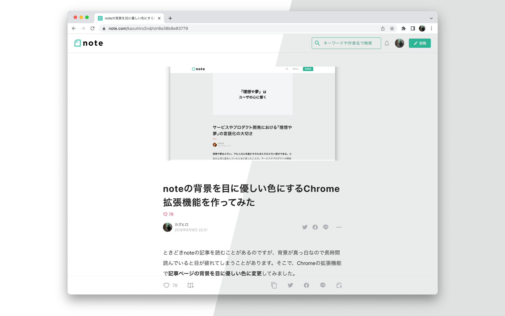
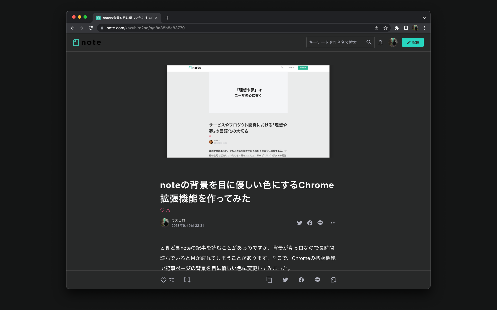

## Features

This Chrome extension changes the backgroud color of an article page on [note](https://note.com) to a more eye-friendly.

### Easy on the eyes

背景色を真っ白からグレーに変更することで、長時間記事を読んでも目を疲れにくくします（科学的なテストを行ったわけではありませんのであらかじめご了承ください）。

### Accessible

背景色をグレーにするも最適なコントラスト比を維持することで、色覚に問題があっても読みやすさを損ねないようにしています。具体的には、[WCAG 2.1](https://www.w3.org/TR/WCAG21/#contrast-enhanced) で定められたレベル AAA の基準（コントラスト比 7.0 以上）をクリアしています。

記事の文字色が `#222222`、変更後の背景色が `#EAEBEB` であるため、コントラスト比は 13.3 となります（2020 年 5 月 16 日時点）。

### Dark color schemes supported

The gray background color is still too light for browsing in a dark color scheme
(also called dark mode or dark theme). This extension darken the backgroud and
also optimize other colors to the dark appearance when the OS appearance is set
to a dark color scheme.

## Installation

You can install the extension from the [Chrome Web Store](https://chrome.google.com/webstore/detail/background-color-enhancer/lmfhfgllepkjlgilfimmibkkphaafgnk).

## Contributing

If you encounter any bugs or have any questions, please see the [issues](https://github.com/k-miyata/notemu-chromeextension/issues).

Also, I welcome pull requests to propose your ideas! Please refer to following development process:

1. Clone this repository.
2. Write code.
3. Test your changes on Chrome. You can load `src` directory from the Extensions page in developer mode.
4. Change `version` in `manifest.json`.
5. Send a pull request.

After this changes are approved, the repository owner will publish the update on the Chrome Web Store:

6. Merge the pull request into `main`.
7. Execute `build.sh` to make `package.zip` in `dist` directory.
8. Upload the package to the Chrome Web Store.

## License

See [LICENSE](./LICENSE).
