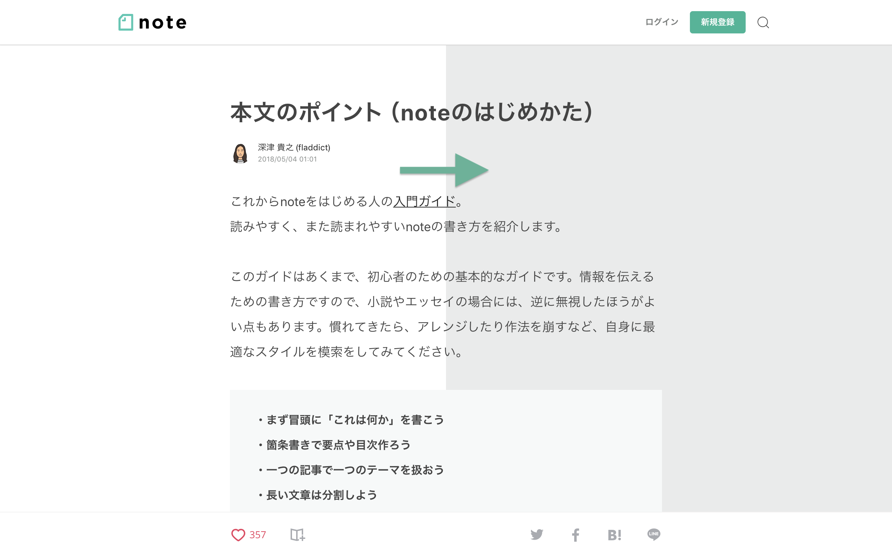

# Chrome Extension: Background Color Enhancer for note.mu

This is the Chrome extension enhances the background color that is good for eyes on an article page of note.mu.

note.mu の記事ページの背景を目に優しい色に変更する Chrome 拡張機能です。

## Features

### 目の負担を軽減

背景色を真っ白からグレーに変更することで、長時間記事を読んでも疲れにくくします。

### アクセシビリティに配慮

背景色をグレーにするも最適なコントラスト比を維持することで、色覚に問題があっても読みやすさを損ねないようにしています。具体的には、[WCAG 2.1](https://www.w3.org/TR/WCAG21/#contrast-enhanced) で定められたレベル AAA の基準（コントラスト比 7.0 以上）をクリアしています。

記事の文字色が `#444444` で変更後の背景色が `#EAEBEB` であるときのコントラスト比 8.15。2018 年 9 月 9 日に確認。

## Installation

[Chrome ウェブストア](https://chrome.google.com/webstore/detail/background-color-enhancer/lmfhfgllepkjlgilfimmibkkphaafgnk)からインストールできます。

## Reporting bugs and requesting enhancements

不具合報告または機能改善のリクエストは [issue](https://github.com/k-miyata/notemu-chromeextension/issues/new) からお願いいたします。

## Development

1. Clone this repository.
2. Write code.
3. Test your changes on Chrome. You can load `src` directory from the Extensions page in developer mode.
4. Change `version` in `manifest.json`.
5. Execute `build.sh` to make `package.zip` in `dist` directory.
6. Upload the package to the Chrome Web Store.

## License

The source code is released under the MIT license.
